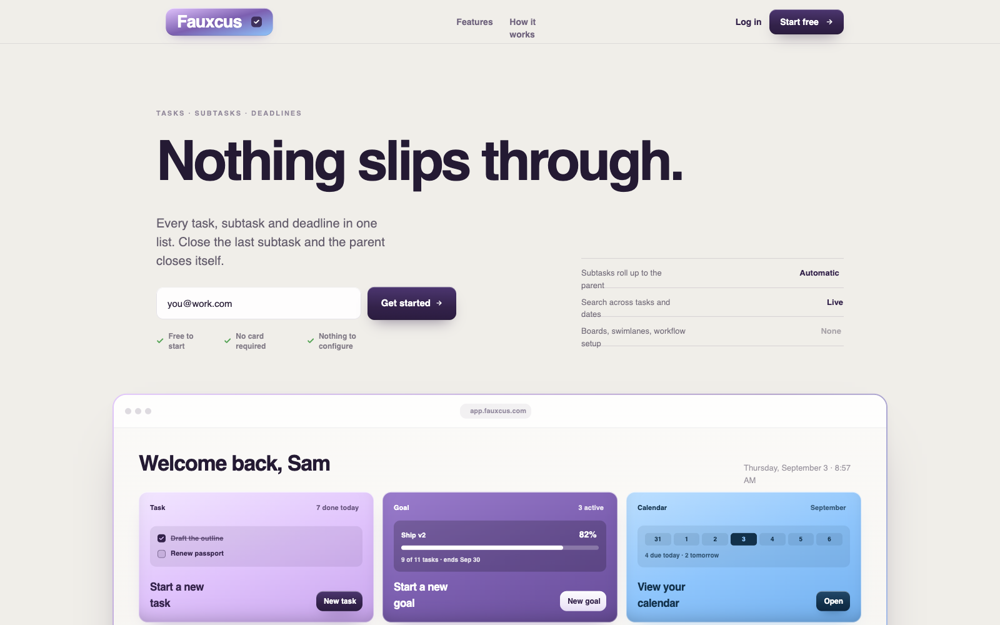
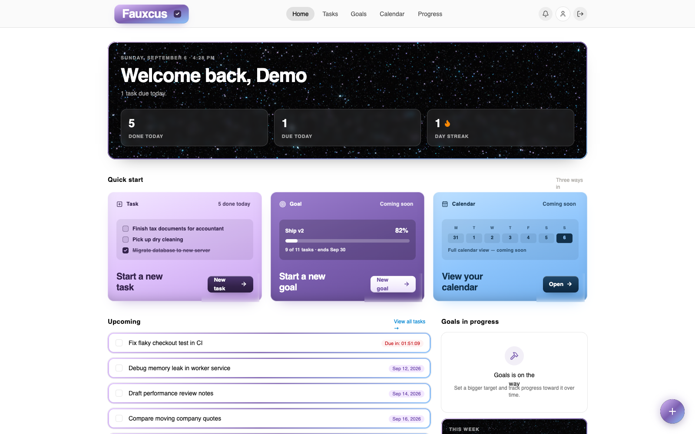
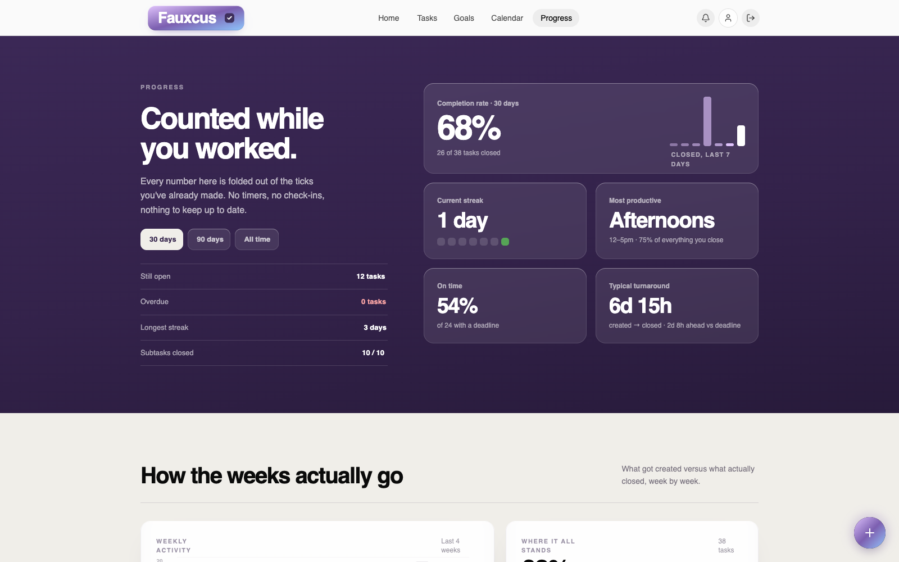

<p align="center">
  
</p>

<h1 align="center">Task Management App (Django + DRF + React + Docker)</h1>

<p align="center">
  <a href="https://github.com/danielbkuti/fauxcus/actions/workflows/ci.yml"></a>
  
  
  
  
  
</p>

## Overview

Fauxcus is a full-stack task management app: a Django REST Framework API backing a React (Vite) frontend, running in Docker. It tracks tasks and subtasks with deadlines, surfaces urgency through a state-driven visual system (on-track / due-soon / overdue / completed), and layers in the kind of small-scale polish — completion celebrations, scroll-reveal animations, live progress stats — that a plain CRUD task list usually skips.

This project demonstrates:

- Full-stack REST API design (DRF backend, React frontend consuming it over session-cookie auth)
- Relational data modeling with cascading completion logic
- A real digit-code email verification signup flow, with rate limiting
- State-driven UI architecture (one deadline-derived theme drives a card's colors, banners, and animations)
- Containerized development environment
- Automated backend testing
- A free, single-service production deployment (Render + Neon Postgres) — see [Deployment](#deployment)

### Live demo

**[fauxcus-api.onrender.com](https://fauxcus-api.onrender.com)**

Log in with `demo@example.com` / `DemoPass123!` to see a seeded account with real tasks and subtasks in every deadline state. It's hosted on Render's free tier, so the first request after a period of inactivity can take about a minute to spin the container back up — later requests are fast.

---

# Architecture

```
React frontend (Vite)
        ↓
Django REST API (DRF)
        ↓
PostgreSQL
        ↓
Docker Containers
```

Components:

| Layer | Technology |
|------|------------|
| Frontend | React (Vite), Tailwind v4, shadcn/ui |
| Backend | Django |
| API | Django REST Framework |
| Database | PostgreSQL |
| Background jobs | Celery + Redis (local dev — see [Deployment](#deployment)) |
| Containerization | Docker |
| Authentication | Custom Django user model, session-cookie auth |
| Testing | Django + DRF Test Framework |

---

# Deployment

The diagram above is the local dev shape — frontend and backend as two separate processes talking over HTTP, per `docker-compose.yml`. Production ([render.yaml](render.yaml)) collapses that into one Docker service instead:

```
Render (single Docker service, Dockerfile.render)
  ├─ React build (frontend/dist), served directly by Django via WhiteNoise
  └─ Django REST API
        ↓
  Neon Postgres (managed, external)
```

This isn't just a smaller footprint — it fixes a real bug the two-service split had. `*.onrender.com` subdomains count as separate sites for cookie purposes (the same reason `*.vercel.app`/`*.github.io` work this way), so a frontend on one subdomain calling an API on another was a third-party-cookie request, and browsers increasingly block those by default: login worked with a correctly-formed `Set-Cookie` header and still failed, because the cookie never actually got stored. Folding the frontend into the same Django process makes every request same-origin, which makes the whole problem disappear rather than needing cookie-attribute workarounds. See the comments in [render.yaml](render.yaml) for the full writeup.

A few more differences from local dev, all driven by staying on Render's free tier: [render-start.sh](render-start.sh) runs migrations on every boot instead of as a separate step (no Shell access to run one-off commands), and the database is [Neon](https://neon.tech) (free forever) rather than a Render-managed Postgres instance (which expires 30 days after creation).

The deadline-digest scheduler is also handled differently in production than in local dev, though it does run in both, on the same underlying `manage.py send_deadline_digest` command either way. Locally, it's a real broker-backed periodic task: `docker-compose.yml`'s `celery_beat` service schedules it once a day, `celery_worker` runs it, and `redis` is the broker between them (see [backend/flexmaster/celery.py](backend/flexmaster/celery.py)) — replacing what used to be a bespoke sleep-until-target-time loop (`backend/scheduler.py`, now removed) with Celery, the standard tool for this. Render's free tier can't host any of that (no Background Worker or Cron Job for a persistent process), so production instead relies on a free [GitHub Actions scheduled workflow](.github/workflows/deadline-digest-cron.yml) that POSTs to a token-protected endpoint (`/api/internal/send-deadline-digest/`, guarded by `DIGEST_CRON_TOKEN`) once a day. Net effect: the digest goes out daily either way, just triggered by a different scheduler depending on environment.

---

# Features

### Frontend
- Landing page: a type-led, glass-surfaced design with a static product-shot recreation of the real dashboard, a live-data feature grid, and a three-frame "watch it work" filmstrip
- Dashboard: animated welcome header, streak tracking, "Upcoming" list pulled from tasks and subtasks alike
- Task list: filter/sort, bulk select and complete/delete, live date search, scroll-reveal card animations
- Task detail page: a four-state color theme (on-track / due-soon / overdue / completed) driving the whole page's palette, a progress dial, an activity log, and celebration animations (confetti, fireworks) on completion
- Deadline editor: a portal-based wheel picker (day/month/year, optional time-of-day), shared across every place a deadline gets set
- Progress page: a full-bleed stats band (completion rate, streaks, a 7-day sparkline, a 30/90/all-time period toggle) over a chart section — weekly created-vs-closed bars, a status breakdown, a GitHub-style daily-activity heatmap doubling as a streak visual, and day-of-week/time-of-day distributions — plus a searchable archive of everything completed
- In-app notifications: a bell with an unread badge for tasks/subtasks due soon, backed by a daily email digest (see [Deployment](#deployment) for how the digest actually runs in production vs. local dev)

### Authentication
- Custom user model
- Digit-code email verification signup (6-digit code, attempt cap, expiry)
- Login via username or email
- Password reset by email
- Per-IP and per-account rate limiting on auth endpoints

### Task Management
- Create/update/delete tasks and subtasks
- Deadlines with date and optional time-of-day
- Automatic parent-task completion propagation from subtasks
- Per-task activity log (created, renamed, completed/reopened, deadline changes)

### API
- RESTful endpoints
- Filtering
- Ordering
- Pagination
- User-scoped data access

### Infrastructure
- Dockerized development environment
- PostgreSQL container
- Environment variable configuration
- Free production deployment on Render — one Docker service serving both the API and the built frontend, Neon Postgres, zero manual server management (see [Deployment](#deployment))
- Error monitoring in production (Sentry, free tier) — an unhandled exception is otherwise silent: a 500 for whoever hit it, and no record anywhere. Opt-in via `SENTRY_DSN`; a no-op everywhere that isn't set (local dev, CI)

### Data Integrity
- Unique task name per user
- Relational task/subtask consistency
- Serializer validation

### Testing
- API tests
- Model integrity tests
- Authentication tests

---

# Screenshots

### Landing page


### Dashboard


### Task list


### Task detail

The same page in two of its four deadline-driven states — in progress (purple, "far" from due) and completed (green) — showing how the palette, banner, and primary action all come from one state rather than being set independently.


### Progress


---

# API Endpoints
```
- GET /api/tasks/
- POST /api/tasks/
- GET /api/tasks/{id}/
- PUT /api/tasks/{id}/
- DELETE /api/tasks/{id}/

- GET /api/subtasks/
- POST /api/subtasks/
```

 ### Filtering Example

```
/api/tasks/?completed=true
```

### Ordering Example

```
/api/tasks/?ordering=dateCreated
```

---

# Running the Project

### 1. Clone the Repository

```bash
git clone https://github.com/danielbkuti/fauxcus.git
cd fauxcus
```

---

### 2. Create Environment Files

Backend — create a `.env` in the project root:

```
DEBUG=True

POSTGRES_DB=postgres
POSTGRES_USER=postgres
POSTGRES_PASSWORD=postgres
POSTGRES_HOST=db
POSTGRES_PORT=5432

SECRET_KEY=your-secret-key
ALLOWED_HOSTS=localhost,127.0.0.1
FRONTEND_URL=http://localhost:3000
```

Frontend — create `frontend/.env`:

```
VITE_API_BASE_URL=http://localhost:8637
```

---

### 3. Build Docker Containers

```bash
docker-compose up --build
```

---

### 4. Run Database Migrations

```bash
docker-compose exec web python backend/manage.py migrate
```

---

### 5. Run the Frontend Dev Server

```bash
cd frontend
npm install
npm run dev
```

---

### 6. Access the Application

Frontend:

```
http://localhost:3000
```

Backend API root:

```
http://localhost:8637/api/
```

---

# Running Tests

Execute tests inside the Docker container:

```bash
docker-compose exec web python backend/manage.py test
```

---

# Engineering Decisions

### Custom User Model

Allows authentication flexibility and supports future extensibility for user profiles and permissions.

### REST API + Session-Cookie Auth

The backend exposes a RESTful API using Django REST Framework, consumed by the React frontend over session-cookie authentication rather than tokens.

### Subtask Completion Propagation

Task completion state automatically updates based on the completion status of associated subtasks.

### State-Driven UI

A task's deadline (overdue / due-soon / on-track, plus completed) is the single source of truth for its color palette, banner, and animation across both the task list and the task detail page — no state is duplicated or hand-synced between the two.

### UTC Date Handling

All timestamps are stored in UTC to prevent timezone inconsistencies across clients.

### Dockerized Environment

Docker ensures a consistent development environment and simplifies dependency management.

### Single-Origin Production Deployment

Frontend and backend were originally two separate Render services, on two separate `*.onrender.com` subdomains — which turned out to be two separate *sites* as far as browsers are concerned, making every frontend→API request a third-party-cookie situation that got silently blocked despite a correctly-formed `Set-Cookie` header. Rather than chase cookie-attribute workarounds, the fix was architectural: build the frontend into the same Docker image and let Django serve it directly (WhiteNoise + a SPA-fallback route), so there's only one origin and the problem doesn't exist in the first place. See [Deployment](#deployment).

### Broker-Backed Scheduling (Celery + Redis) Over a Bespoke Loop

The deadline-digest job used to be `backend/scheduler.py`: a plain Python script that slept until a target UTC hour and ran the digest command directly, once a day, forever, as its own long-running process. That works, but it's homegrown infrastructure for a problem the ecosystem already has a standard answer to — no retry semantics, no visibility into what ran or failed, and every *additional* background job this app ever needed would mean writing another loop like it. Replaced with Celery (worker + Beat) and Redis as the broker: the schedule lives in Django settings (`CELERY_BEAT_SCHEDULE`) instead of a hardcoded sleep calculation, Celery Beat ticks the schedule, and a separate worker process executes the job — the standard split, and the one any *next* background job in this app would slot into for free. See [Deployment](#deployment) for why this runs in local dev only, not production.

### Error Monitoring (Sentry)

Before this, an unhandled exception in production was invisible — the request just 500s for whoever hit it, and nothing records that it happened at all; finding out meant a user reporting it, if they bothered to. `sentry_sdk.init()` in `settings.py` is gated entirely on `SENTRY_DSN` being set, so it's a genuine no-op everywhere that env var isn't deliberately configured (local dev, CI, this repo's own test suite) — no new behavior, nothing sent, nothing to install or run. `send_default_pii` is explicitly off: only the error itself goes to Sentry, not request/user data, unless that's deliberately turned on later for a specific debugging need.

---

# Future Improvements

- Goals and Calendar pages (currently placeholders)
- JWT authentication

---

# License

MIT — see [LICENSE](LICENSE). Built for educational and portfolio purposes.
